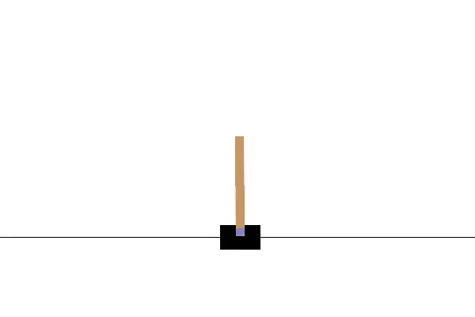
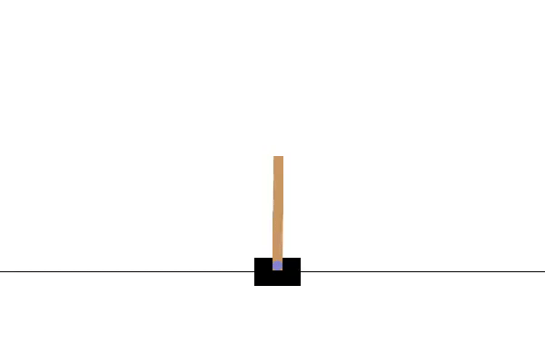
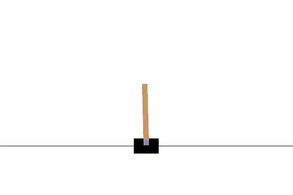
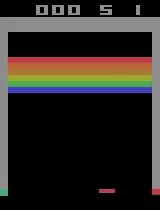
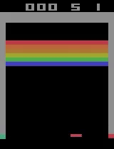
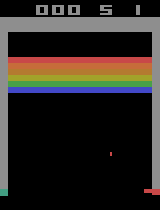

# Automatizirani razvoj agenata za različita okruženja

### Sažetak

Ovaj rad proučava problematiku podržanog učenja gdje se bez znanja o pravilima i funkcioniranju specifične okoline, želi konstruirati agent kojemu je cilj pronaći optimalnu strategiju koja maksimizira očekivanu dobit u određenom vremenskom okviru. Osim opisa podržanog učenja, dubokih modela i algoritama koji se baziraju na dubokim modelima, detaljno je prezentirana struktura _OpenAI Gym_ biblioteke i njenih okolina, te napravljena usporedba u kojoj se analizira uspješnost naučenih agenata dubokog Q učenja, dvostrukog dubokog Q učenja te prednosnog akter-kritičara.

Programsko rješenje implementirano je u programskom jeziku _Python_, primarno koristeći _PyTorch_ radni okvir za dizajn i učenje dubokih neuronskih mreža, te _OpenAI Gym_ biblioteka za simulaciju i testiranje ponašanja agenata.  

### Abstract - _Automated design of agents for various environments_

This thesis studies the issue of reinforcement learning where without knowing the rules and internal dynamics of environment, the goal is to build an agent whose aim is to find the optimal strategy that maximizes the expected reward in a given time frame. Aside from describing the basics of reinforcement learning, deep learning models and model-free algorithms, the key concepts of _OpenAI Gym_ library and its environments are broken down in detail, and a comparison is made between agents implemented using Deep Q Networks, Double Deep Q Networks and Advantage Actor Critic Networks.

Software implementation is written in _Python_, primarily using the _PyTorch_ framework for designing and learning deep neural networks, and the _OpenAI Gym_ library for simulating and testing agent behavior.  

## Links

[Master's thesis (.pdf)](docs/diplomski.pdf)  
[Master's thesis (.pptx)](docs/Diplomski.pptx)

## Results

### Cartpole environment

  <table>
  <thead>
    <tr>
      <td>
DQN Agent
</td>
      <td>
DDQN Agent
</td>
      <td>
A2C Agent
</td>
    </tr>
   </thead>
   <tbody>
    <tr>
      <td></td>
      <td></td>
      <td></td>
    </tr>
   </tbody>
  </table>

### Breakout environment

  <table>
  <thead>
    <tr>
      <td>
DQN Agent
</td>
      <td>
DDQN Agent
</td>
      <td>
A2C Agent
</td>
    </tr>
   </thead>
   <tbody>
    <tr>
      <td></td>
      <td></td>
      <td></td>
    </tr>
   </tbody>
  </table>

